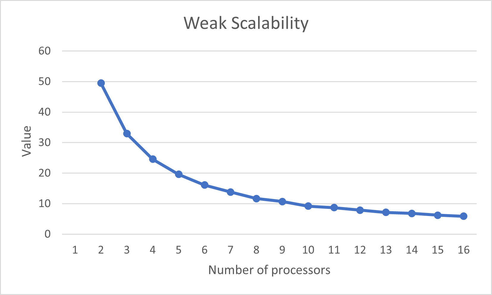
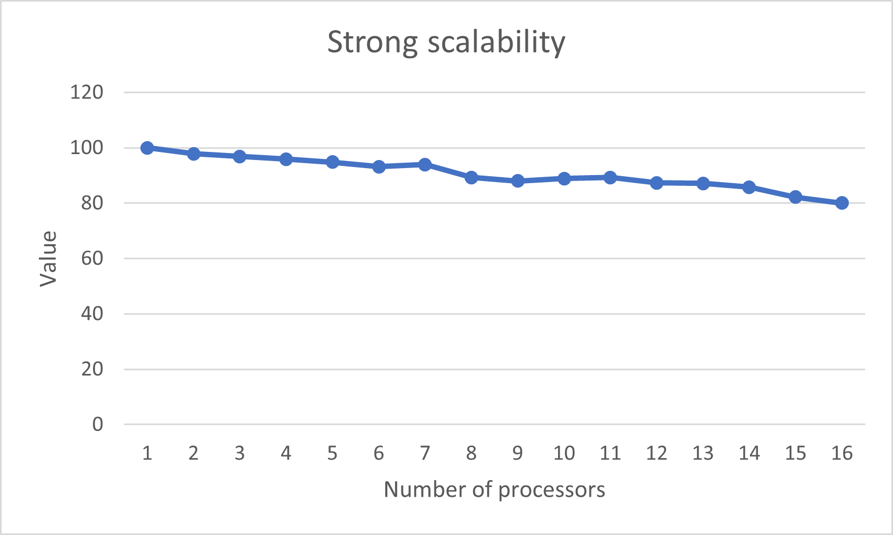
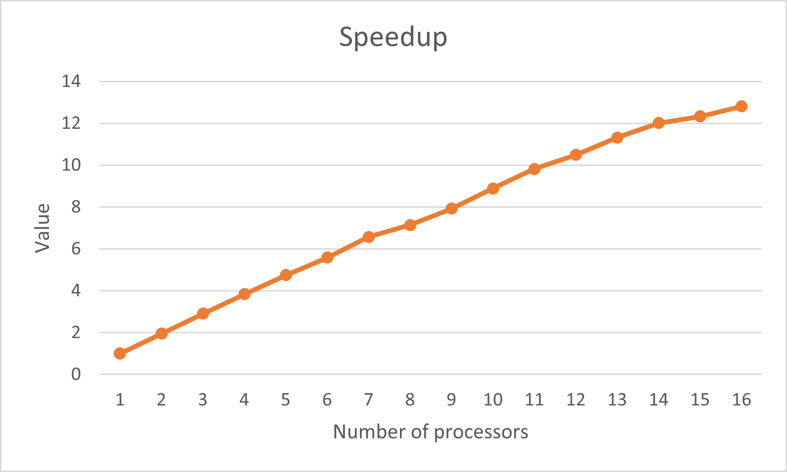
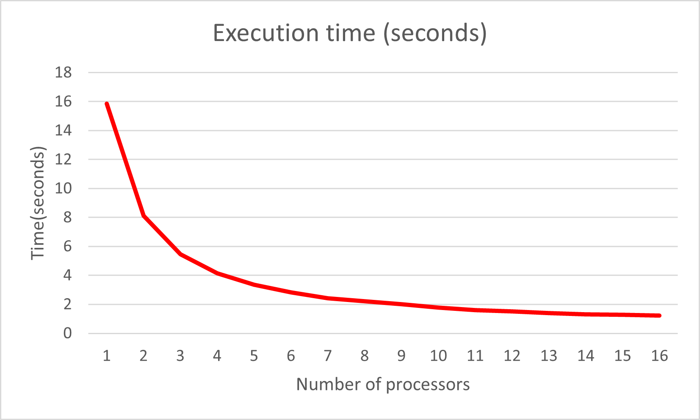
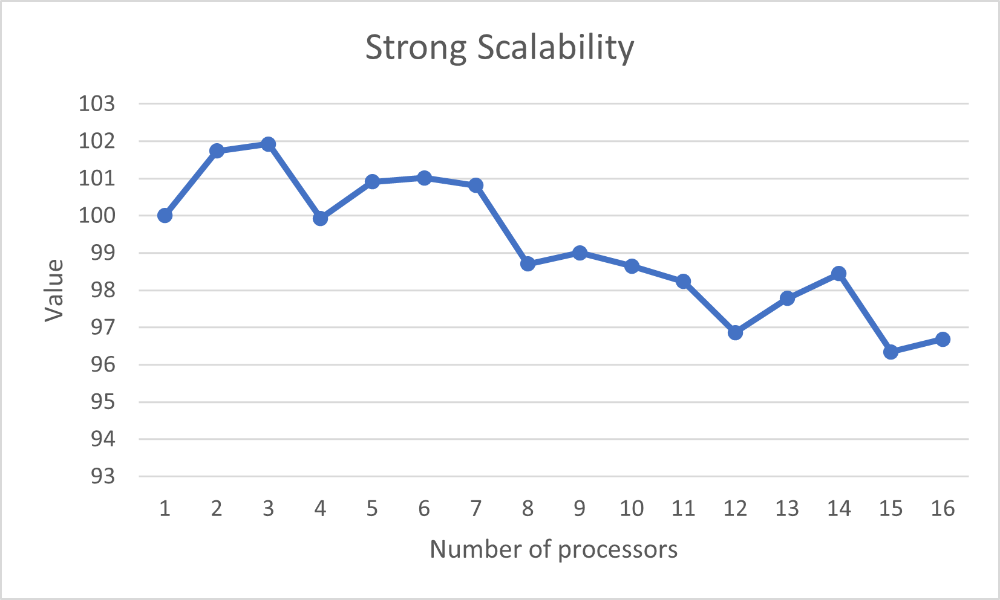
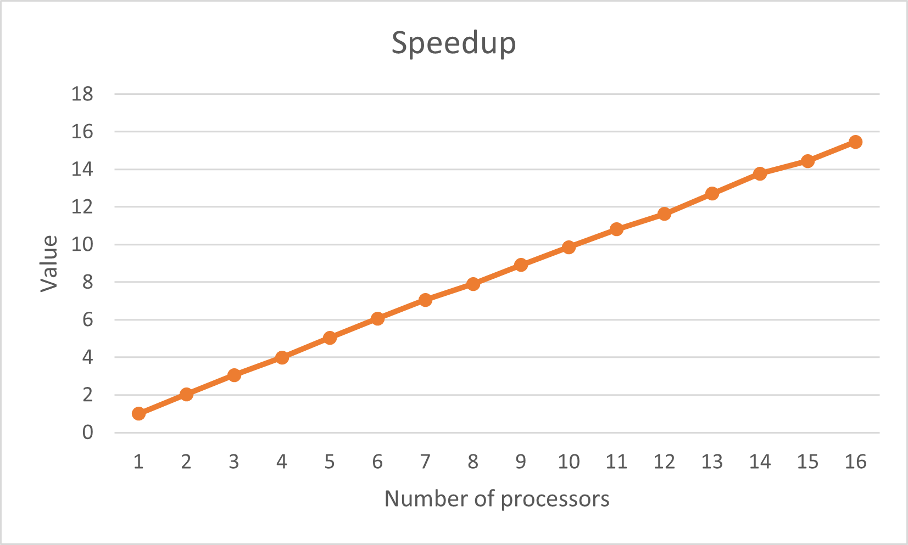
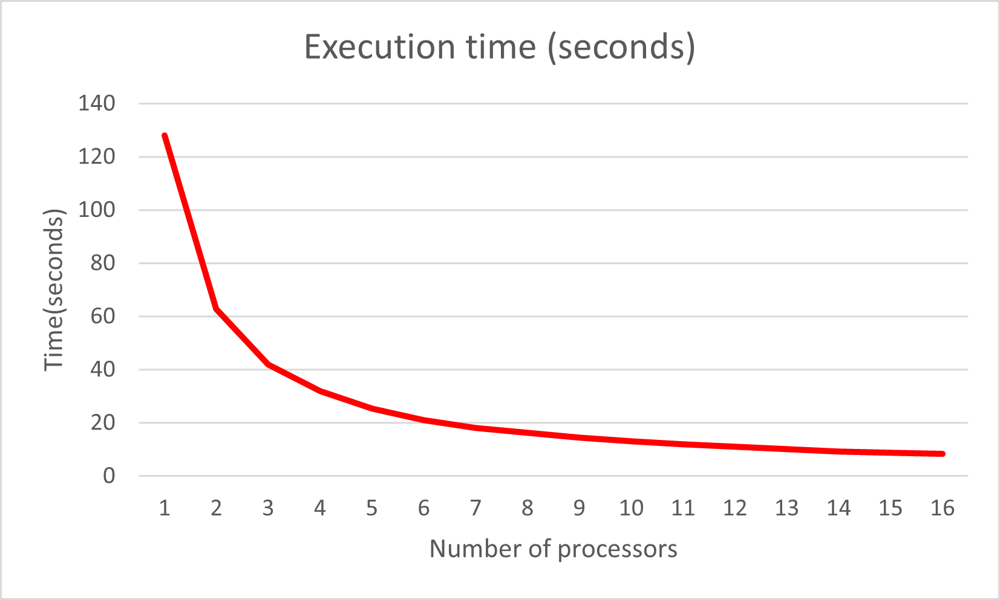
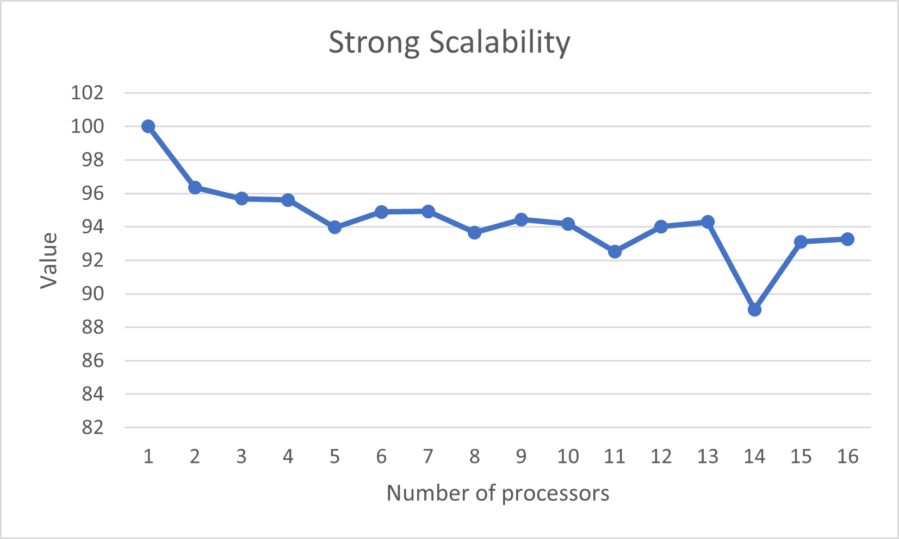
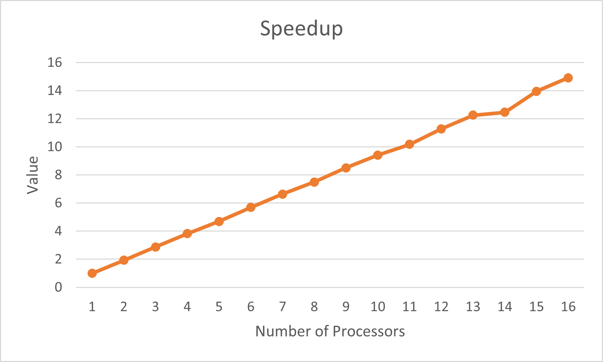
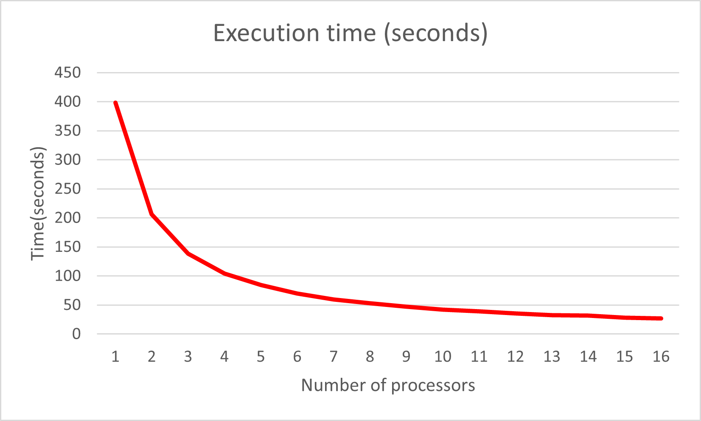

# MPI Parallel Game of Life

Progetto accademico di [**Ciro Perfetto**](https://github.com/ciroperf)

Corso di Laurea Magistrale in informatica: **Programmazione concorrente e parallela su cloud**

Professori: **Vittorio Scarano** **Carmine Spagnuolo**

[Dipartimento di Informatica](http://www.di.unisa.it) - [Università degli Studi di Salerno](https://www.unisa.it/) (Italia)

## Definizione del problema

Il problema consiste nell'esecuzione di "Game of Life", un gioco la cui evoluzione è determinata dallo stato iniziale, senza bisogno di ulteriori input.
Si può interagire creando una configurazione iniziale per vedere come si evolve oppure creando pattern con particolari proprietà.
L'universo di Game of Life è una griglia bidimensionale di celle quadrate, ciascuna delle quali si può trovare in due stati diversi, viva o morta, oppure "popolato" o "non popolato".
Nello sviluppo del progetto è stata usata una matrice di caratteri indicando con 'd' la cella morta e con 'a' la cella viva.
La parte centrale del programma consiste proprio nel fatto che queste celle interagiscono con le celle vicine, che sono quelle orizzontali, verticali o diagonalmente adiacenti.
Ad ogni esecuzione vengono determinati un numero di passi, a ciascun passo nel tempo, occorrono le seguenti interazioni:
- Qualsiasi cella viva con meno di due celle vicine vive, muore come se ci fosse sottopopolamento.
- Qualsiasi cella viva con 2 o 3 celle vicine vive, sopravvive anche nella prossima generazione.
- Qualsiasi cella viva con più di 3 vicine muore, come se ci fosse sovrappopolamento.
- Qualsiasi cella morta con esattamente 3 vicini, diventa una cella viva, come per riproduzione.

La configurazione iniziale costituisce il seed del sistema. La prima generazione viene creata applicando tutte le regole precedenti simultaneamente a ciascuna cella del seed iniziale. Ciascuna generazione successiva viene creata solo in funzione di quella precedente, continuando ad applicare le regole.


## Soluzione proposta

Per il problema sono stati utilizzati due approcci:
- un programma funzionante su un singolo core che non usa librerie di OpenMPI
- un programma che sfrutta il parallelismo utilizzando le librerie di OpenMPI

Prima di spiegare le soluzioni adottate al problema bisogna anche considerare che a ogni iterazione del programma, nella matrice di caratteri utilizzata come seed, la riga della matrice alla posizione 0 e la riga alla posizione N-1 (dove N è il numero delle righe totali) sono considerate come vicine, quindi si influenzano a vicenda ad ogni generazione, creando una struttura toroidale. <br />
Il [primo](Code/OneThread.c) ha un approccio più semplice al problema, generando un seed iniziale casuale e poi applicando le regole ad ogni cella fino a che non si raggiunge il numero di generazioni date in input. Dopo ogni passo viene aggiornata la matrice in output finchè non si arriva al numero di passi inserito. <br />
Il [secondo](Code/Game.c) offre una soluzione più complessa, in quanto il problema viene diviso equamente dal master che manda le porzioni di matrice agli altri processori, facilitando così l'esecuzione del programma su matrici di grandi dimensioni, e ognuno di essi elabora gli input applicando le regole. Successivamente vengono mandati i bordi ai processori adiacenti. Una volta eseguite il numero di generazioni richieste, il processore con il rank 0, che partecipa anche'esso alla computazione, raccoglie i dati di tutti gli altri processori e inserisce i risultati nella matrice che viene poi data in output.

## Struttura del progetto

Verrà analizzato nel dettaglio la struttura di [Game.c](Code/Game.c) analizzando gli aspetti cruciali della soluzione al problema.

### Funzioni MPI

Le funzioni di MPI usate oltre quelle fondamentali sono:
- MPI_Isend
- MPI_Irecv
- MPI_Wait
Sono state usate queste funzioni per sfruttare la comunicazione non bloccante, in quanto dopo che il master ha suddiviso e mandato gli input agli altri processori questi già possono elaborare le porzioni interne prima che ricevano i bordi dai processori adiacenti, velocizzando così il processo di computazione.

### Sezioni di codice

In tutti i processi vengono mandati e poi ricevuti i bordi della matrice in comunicazione non bloccante, in modo che possano essere eseguite altre istruzioni.

```
MPI_Isend(&borders[0][0], M, MPI_CHAR, source, tag, MPI_COMM_WORLD, &request_send);
MPI_Isend(&borders[1][0], M, MPI_CHAR, dest, tag, MPI_COMM_WORLD, &request_send);
MPI_Irecv(&borders_received[0][0], M, MPI_CHAR, source, tag, MPI_COMM_WORLD, &request_receive);
MPI_Irecv(&borders_received[1][0], M, MPI_CHAR, dest, tag, MPI_COMM_WORLD, &request_receive1);
```

Se il numero delle righe presenti nel buffer di ricezione è maggiore di 2 allora si possono aggiornare le righe interne della matrice nel mentre il processo non riceve i bordi dagli altri.

```
if(n > 2) {
  interior = 1;
  for (i = 2; i < n; i++) {
    for (j = 0; j < M; j++) {
      for(d = 0; d < 8; d++) {
        x = i + directions[d].dx;
        y = j + directions[d].dy;
        if (isInMatrix(x,y)) {
          if (temp[x][y] == 'd') {
            cells_dead++;
          } else if(temp[x][y] == 'a') {
            cells_alive++;
          }
         }
       }
       buffer[k][j] = cellChecker(temp[i][j], cells_alive, cells_dead);
       cells_dead = 0;
       cells_alive = 0;
     }
    k++;
  }
}
```

Il processo rimane in attesa che le receive concludino.

```
MPI_Wait(&request_receive, &status);
MPI_Wait(&request_receive1, &status);
```

Una volta ricevuti i bordi e computate le sezioni interessate, vengono aggiornati i bordi da mandare alla prossima iterazione. Se il numero di passi è superiore a quello inserito dall'utente, il processo manda le informazioni al rank 0 e termina.

```
for (i = 0; i < M; i++) {
  borders[0][i] = buffer[0][i];
}
        
if (n > 1) {                
  for (i = 0; i < M; i++)
  borders[1][i] = buffer[n-1][i];
} else {
  for (i = 0; i < M; i++)
  borders[1][i] = buffer[0][i];
}

step++;

if (step >= STEPS) {
  tag = 1;
  MPI_Send(&(buffer[0][0]), n*M, MPI_CHAR, 0, tag, MPI_COMM_WORLD);
  free(temp[0]);
  ...
  break;
}
```

## Analisi delle prestazioni

I test sono stati eseguiti su 8 macchine m4.large su AWS, ognuna con 2 core a disposizione e 8 GB di RAM. I tempi di esecuzione con un processore sono stati calcolati usando il programma [**OneThread.c**](Code/OneThread.c)

### Scalabilità debole

Per la scalabilità debole sono stati eseguiti dei test aumentando gradualmente la taglia, cioè il numero delle righe e delle colonne delle matrici. Il numero di step (100) è uguale. Il numero di righe della matrice parte da 500 e il numero di colonne da 600 per la computazione su un singolo processoree e sono stati moltiplicati questi valori per il numero di processori usati per ottenere le taglie incrementate.



### Scalabilità forte

Per la scalabilità forte sono stati eseguiti i test su 3 matrici di dimensioni differenti e cambiando anche il numero degli step. Verranno mostrati anche i grafici relativi allo speedup ottenuto e ai tempi di esecuzione.

#### Matrice 1000x1100, 100 step




#### Matrice 2000x2100, 200 step




#### Matrice 3000x3100, 300 step




## Istruzioni di esecuzione

Per eseguire il programma [**OneThread.c**](Code/OneThread.c), bisogna compilare il file con il comando *gcc* ed eseguire l'eseguibile generato.

Per eseguire sul cluster [**Game.c**](Code/Game.c) bisogna:
- compilare il file con *mpicc Game.c -o game*
- creare un hostfile con i riferimenti alle macchine che devono essere usate per la computazione ma è opzionale a seconda delle esigenze.
- Il comando da utilizzare per avviare il programma è *mpirun -np NUMERO_DI_PROCESSORI --hostifle hfile ./game RIGHE COLONNE PASSI*

È importante notare che il programma non funziona con un solo processore e i parametri aggiuntivi sono obbligatori.

- **NUMERO_DI_PROCESSORI**
È il numero di processori che MPI userà per l'esecuzione

- **RIGHE**
È il numero di righe che avrà la matrice utilizzata

- **COLONNE**
È il numero di colonne che avrà la matrice utilizzata

- **PASSI**
È il numero iterazioni che verranno effettuate sulla matrice

## Considerazioni finali

In termini di scalabilità debole, il programma ha ottenuto delle performance discrete, in quanto la computazione sfrutta molto le risorse in termini di CPU poiché per ogni cella aggiunta bisogna analizzare tutte le celle adiacenti per determinare lo stato nella generazione successiva. Quindi aumentare la taglia della matrice fa degradare di molto le performance, anche se sfruttando molti processori le prestazioni tendono a stabilizzarsi.

Per quanto riguarda la scalabilità forte, i risultati ottenuti sono ottimi, in quanto si è ottenuto un alto grado di scalabilità e tempi di esecuzione molto bassi. Quindi l'utilizzo della computazione parallela si dimostra altamente efficace per la risoluzione di questo problema.

